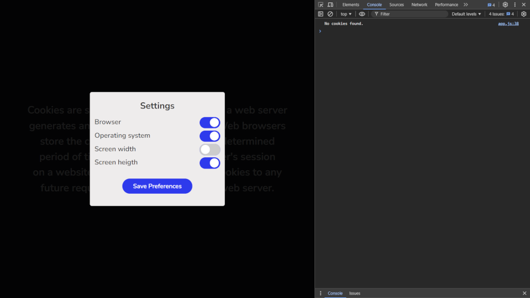
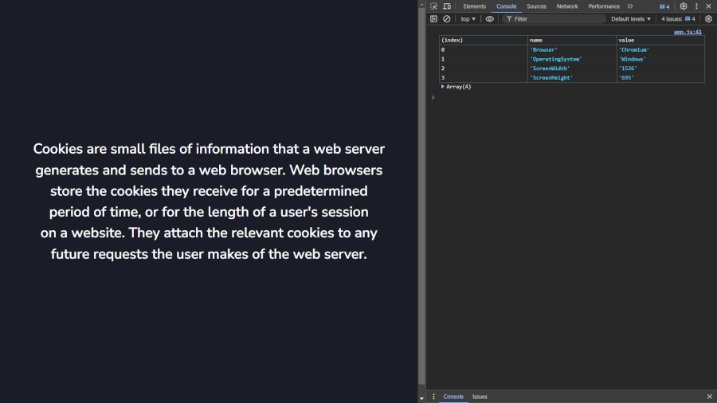

# Cookie

This project is an example implementation of cookie consent modals using HTML, CSS, and JavaScript. It displays an initial modal asking the user to accept cookies or adjust settings. The modal allows users to choose which information to share, such as browser, operating system, screen width, and screen height.



## 🖥️Technologies Used


## 🖱️Installation
To run this project locally, follow these steps:
1. Clone the repository:
    ```sh
    git clone https://github.com/douglasfssantiago/Cookies.git
    ```
2. Navigate to the project directory:
    ```sh
    cd cookie
    ```
3. Open `index.html` in your browser to view the application.

## 🔗Project Demo
You can see the live demo of the project [here](https://douglasfssantiago.github.io/Cookies/).

## Features 
- Cookie consent modal. 
- Settings modal to select which information to share. 
- Save cookie preferences in browser cookies. 
- Clear old cookies before setting new ones.

## Project Structure 
- `index.html`: Main HTML file containing the modal structure. 
- `styles.css`: CSS file for styling the modal and the page. 
- `script.js`: JavaScript file that manages the modal logic and cookies.



&copy; Created by Douglas F S Santiago.